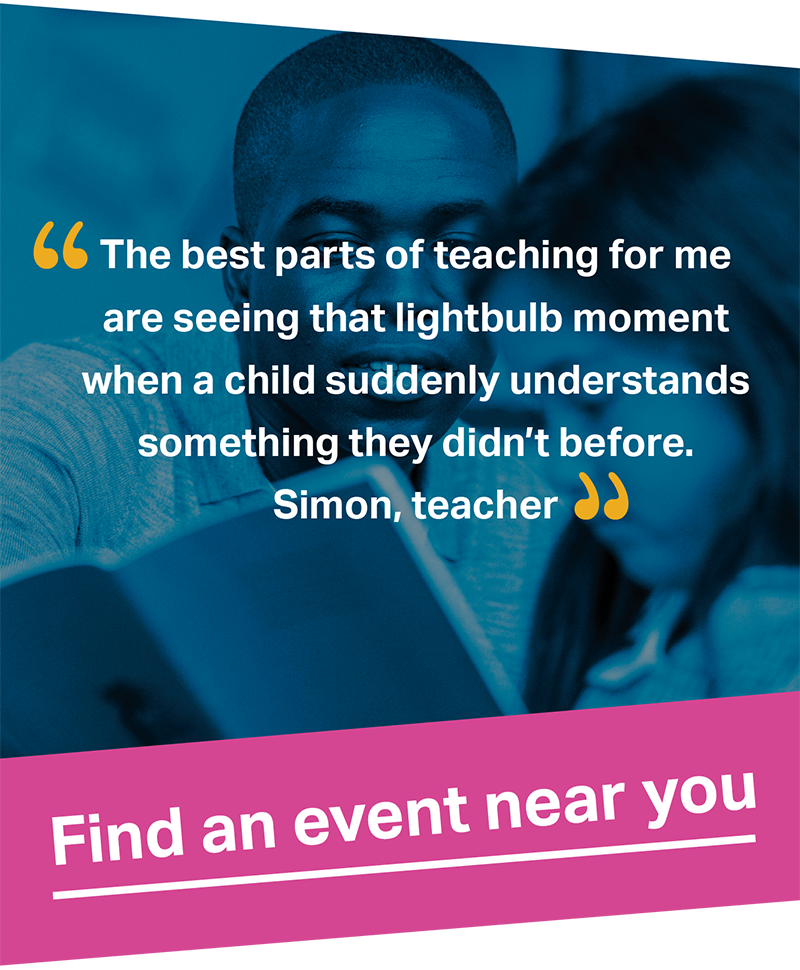

#[Why I became a teacher](./life-as-a-teacher/real-stories#climbing-the-career-ladder)

As a newly qualified teacher, Paul was keen to move up the teaching career ladder.

[Read Paul's story and others](./life-as-a-teacher/real-stories#climbing-the-career-ladder "internal")

#[Discover the steps to become a teacher](./steps-to-become-a-teacher)

[Use our step by step guide to help you with what you need to become a teacher](./steps-to-become-a-teacher "internal")

Sign up and get advice on how to take your next steps into teaching

[Sign up for an advisor](https://register.getintoteaching.education.gov.uk/register "external")

Come to a free teaching event and find out how you can train to be a teacher.

