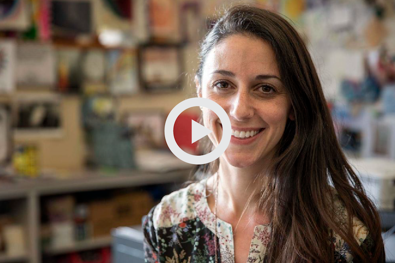
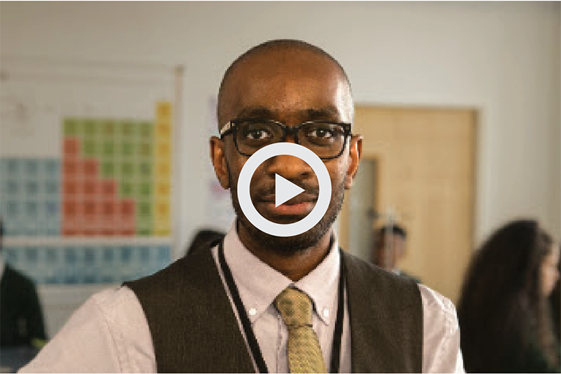

section{
##From senior associate lawyer to assistant headteacher  

###Helen Winter, director of teaching school and assistant headteacher

Helen went on a journey to transition from lawyer to teacher - and hasn't looked back since. She is now on the same salary as she was as a senior associate lawyer. In addition, Helen’s progression to a leadership group teacher was also quick.

<a href="#helens-story" class="case-study-link">Read Helen's story </a>

Helen Winter began her career as a lawyer; however, after re-evaluating her career, she embarked on a journey to transition from lawyer to teacher. With support from her sister, who is a teacher, Helen tested the water by gaining some school experience before making her final decision.

> “I was instantly hooked after gaining school experience. The inspirational teachers I saw motivated me; not only did they have the ability to deliver a subject with real zeal and passion but also to develop and ignite curiosity in their pupils. There is no better job satisfaction than watching a child succeed and especially if they have had to overcome obstacles or are lacking in self-belief,” says Helen.

As a teacher, you’ll not only be able to progress quickly in your career, a career in teaching will also provide you with more job satisfaction, this is something Helen agrees with: “It is the only job where I can honestly say you get 100% job satisfaction. It is lovely to watch your pupils grow into young adults and when they receive their exam results, and realise it was all worthwhile, there is no greater pleasure. Being part of helping shape a young person’s future is very humbling as well as fulfilling.”

With various roles available in teaching – there will always be opportunities to progress. As you climb the career ladder, you will also climb the teachers' salary ranges. In fact, Helen is on the same salary as she was as a senior associate lawyer. In addition, Helen’s progression to a leadership group teacher was also ‘rapid’.

Two years after I qualified as a teacher, I was head of a department and learning to learn co-ordinator. The following two years I continued to progress and now I'm the director of teaching school and assistant headteacher. My progression has been rapid -  I’ve been very fortunate to be promoted quickly. If you're passionate and committed, the teaching world is very much your oyster. There are various opportunities to climb the ladder.

> “My next step is to apply for deputy headteacher - after that, who knows. It is good to see women in senior positions and I hope to be one of those. However, you must remember that pupils are at the heart of everything we do and that positive thinking and determination can get you anything you desire.”

If you want a career that provides you with job satisfaction and swift progression, register with us to gain personalised support to help with your journey into teaching.

}

section{
##Owen’s rapid career ascent

###Dr Owen Mather, leader of teaching standards

Just one year after completing his postgraduate teacher training, Owen progressed to head of department – and since then, he has continued to climb the career ladder.

<a href="#owens-story" class="case-study-link">Read Owen's story </a>

Just one year after completing his postgraduate teacher training, Owen progressed to head of department – and since then, he has continued to climb the career ladder. Four years later, he is now undertaking consultancy work at various schools, as well as training as a specialist leader of education and leader of teaching standards.

Many aspects of the job attracted him to teaching – particularly the clear-cut career ladder. He explains: “There’s an open field of play, due to the fact that wherever you are, there’s always a school nearby offering opportunities.”

In fact, Owen says his pay has increased since leaving his previous profession as a senior research scientist in the pharmaceutical industry. “The salary is much better than most expect. Although you may take a hit when you initially change careers, if you’ve got the skills, you can climb back up quickly. In addition there are opportunities to earn further salary enhancements when you take up additional responsibilities.”

After 5 years of teaching, Owen is now on the leading practitioner salary range, but Owen is most motivated by the ‘light-bulb’ moments students achieve when learning new things, and he especially enjoys results day. “Results day is when you see the outcome of all the teaching and hard work, and seeing the next generation of scientists, engineers and doctors is incredibly rewarding.”

Owen recommends pursuing a career in teaching, particularly because of the amount of flexibility and progression opportunities on offer: “If you can do it, it’s the best job in the world. It’s better paid than most people realise, and most of all, it’s incredibly rewarding. All day, you get to spend time focusing on the subject you’re passionate about and you get to impact the next generation with your skills and enthusiasm.”

Why not emulate Owen’s ascent to leadership and apply for teacher training? It’s easier than you may think - with a tax-free bursary to train as a teacher. Register with us to access our dedicated advisers, who will support you with your career switch.

}

section{
##Climbing the career ladder

###Paul Evason, assistant headteacher

As a newly qualified teacher, Paul was keen to move up the teaching career ladder – now he’s reached assistant headteacher he shares his story on why he got into teaching and his tips on career progression.

<a href="#pauls-story" class="case-study-link">Read Paul's story </a>

As a newly qualified teacher, Paul kept climbing the teaching career ladder – now he’s reached assistant headteacher he shares his story on why he got into teaching and his tips on career progression.

> “I always wanted to work in an environment that was never going to be the same every day – teaching provides this. Working with students and preparing them for their next steps was always a huge draw to the profession. In addition to working with a range of students with different backgrounds and helping them to succeed.”

As a teacher, you’ll have the opportunity to develop to succeed in your career, and realise your professional and personal ambitions. Before Paul was assistant headteacher – he enjoyed a number of different roles learning new skills that would help him to keep on moving forward in his teaching career.

> “When I started teaching as a newly qualified teacher, I looked for opportunities to support the school and to enhance my experience. For example, in my first year, I led on re-designing the KS3 curriculum, and in my second year I started to become involved in the school’s virtual learning environment. All of this added to my experience and provided me with plenty to talk about when applying for new roles.”

There are plenty of progression opportunities in teaching – you just have to grasp them.
Now as an assistant headteacher Paul is clear on the next role he would want to undertake: “My long-term plan is to go into headship, but do not want to rush this. I want to be able to experience a range of different areas in schools to ensure that I am fully prepared for the challenges that a headship role will bring.”

As you progress as a teacher, so will your salary - in fact, the average salary of leadership group teachers is £58,881. However, it’s not the salary that motivates Paul but to ensure that pupils succeed in life:  “I feel fortunate to be on the leadership salary, but I don’t do the job for the money – for me it’s about supporting students as a teacher and leader and making sure they achieve their full potential.”

}

section{
##Leaping to head of department

###Jon Simons, head of department

Jon hasn't looked back since starting his teaching career - he was head of year 18 months after qualifying as a teacher, and a year later he was promoted to head of department. Find out how the support and guidance you get as a teacher can help you progress.

<a href="#jons-story" class="case-study-link">Read Jon's story </a>

After six years of working in the world of recruitment consultancy, Jon felt it was time for a new career. Determined to embark on a path where he could channel his passion into helping others, Jon started to investigate a career in teaching.

> “I had two degrees: Master’s merit in management and a degree in geography, so I was thinking of teaching either business or geography. However, after some hard thinking, my real passion lay in teaching geography. In addition, it was clear to me that geography is becoming a subject that will rise in importance and be in far more demand over the next decade,” says the head of department.

But there was another motivation that made Jon consider a career with a better work-life balance: “I was working away a lot and spending less and less time with my family. This was another reason I decided to investigate a career in teaching.”

Jon admits he had some initial reservations about starting a new career, particularly the financial implications: “This was a huge consideration – but was offset by having access to a bursary. Without a bursary, I would still be in my old career. I simply wouldn’t have been able to maintain my rent and loans, and pay university fees without my bursary.”

Now four years into his teaching career, Jon hasn’t looked back – he was head of year 18 months after qualifying as a teacher, and a year later he was promoted to head of department.
“I am still currently progressing further in my teaching career. My advice is to be active in what you do outside of the classroom and try to get involved in school initiatives as soon as possible – this will aid your progression.”

> “With yearly performance reviews, you have the opportunity to highlight your skills and the positive impact you’ve had on your school. In this review, I double jumped up the pay range and with extra responsibilities you can achieve additional increases to your salary.”

> “It’s a privilege to play a big part in a young person’s life. A good teacher is crucial to a young person’s development. Let’s face it; we all have at least one story of our favourite teacher going above and beyond to help us when we were at school.”

Thousands of people successfully retrain as teachers every year, and applying for teacher training may be easier than you think. Tax-free bursaries are available and dedicated advisers are on hand to support your move into teaching. Register with us for tailored advice and assistance in beginning your new career.

}

section{
##From NQT to head of biology in two years

###Sarah Fisher, head of biology

Sarah never saw herself working in a nine-to-five office job, and has embraced the challenges and career progression teaching has to offer. She made the jump from NQT to head of biology in just two years.

<a href="#sarahs-story" class="case-study-link">Read Sarah's story </a>

Two years after qualifying as a teacher, Sarah progressed to head of biology, climbing the career ladder and strengthening her department in the process. But Sarah always had an inkling that teaching was the right direction. “From an early age, I knew a teaching career was for me. I could not imagine working a typical nine-to-five desk job. Every day in teaching brings a new challenge and new situations, which is what makes the job so exciting,” Sarah says.

With new challenges come rewards and Sarah maintains that her favourite aspect of teaching comes from seeing the difference she makes to her pupils. “The best part of teaching is being in front of my 32 students and seeing how my passion for the subject I teach rubs off on them. When they have those ‘light bulb’ moments, hearing the sudden ‘So that’s how it works!’ and seeing your pupils take your subject into A level and beyond makes the job so worthwhile.”

Reflecting on her fast progression, Sarah takes pride in the difference she has been able to make to her department. “I am extremely proud of my teaching achievements and career progression so far... The encouragement and support from my head of faculty really helped; they saw the potential in me and I’m so grateful for that opportunity.

> “With my leadership skills, my department has gone from strength to strength. We have managed to increase uptake of students from a class of 20 A level students to 50. This was a great achievement, and I could not have done this without the support of my colleagues and the leadership courses I attended.”

Making the most of opportunities available to her, Sarah has also taken on extra responsibilities that allow her to make a real impact in the teaching community. “I also act as a teaching and learning mentor, which allows me to work with staff from all departments to enhance and develop their teaching and learning. I love being able to work with teachers of all backgrounds, experienced to newly qualified, sharing good practice and developing whole-school strategies. I am currently facilitating an NQT leadership programme for teachers across the borough, which I am thoroughly enjoying.”

For anyone looking to emulate Sarah’s success, she gives the following advice: “I would recommend hard work, maintaining your love for the job, and a want to bring about positive change to young peoples' lives… Undeniably, teaching is hard work – but the knowledge that you have helped to motivate young people and helped shape their future brings more satisfaction than any other job I can think of.”

}

section{
##The rapid career climber

###Olly Carr, assistant headteacher

Oxford graduate Olly briefly considered a career in finance before deciding that wasn’t for him. Instead he chose to use his degree to share his passion for physics and make it accessible for all pupils. He hasn’t looked back since – quickly climbing the career ladder via a number of leadership roles.

<a href="#ollys-story" class="case-study-link">Read Olly's story </a>

Olly graduated from Oxford in 2008 with a 2:1 in philosophy, politics and economics. During his studies, he completed an internship in corporate finance – and it took him less than week to realise that wasn’t the career for him. Wanting to make a difference for other people, he decided to change tack.

> “I applied to take the Bromley Collegiate Physics school-centred initial teacher training course straight after finishing my degree in September 2008, and I haven’t looked back since,” says the now assistant headteacher.

To brush up on a chosen teaching subject that wasn’t part of his degree, Olly enrolled in a physics subject knowledge enhancement (SKE) course prior to starting his teacher training. These free refresher courses are available to candidates who would like to teach maths, physics, chemistry, languages or design and technology.

> “I chose physics as I had always loved the subject for its precision and clarity, and I wanted to teach a range of ages, which may not have been possible teaching my degree subjects.”
He was offered a job at one of his placement schools, and his rapid climb up the career ladder shows how quickly you can progress as a teacher. Here’s a rough lowdown on his ascent from new graduate to assistant head in just six years:

  - Year 1: induction year as a newly qualified teacher (NQT)
  - Year 2: promoted to assistant head of sixth form
  - Year 3: becomes the achievement coordinator for Year 13; starts teaching economics alongside physics
  - Year 5: becomes head of sixth form on maternity cover
  - Year 6: moves on to a new school as assistant headteacher

> “I feel that I have learned a huge amount over the past six years, and have developed as a teacher and leader by working alongside talented, hard-working members of staff,” says Olly. “Every day really is different, and I always leave work challenged and satisfied.”

}

section{
##Become a role model in your school

###Karen Falcon, head of geography

From newly qualified teacher (NQT) to head of faculty in just five years, geography teacher Karen says she “couldn’t have made a better decision” than joining the profession. While her classroom time has been reduced, she still thrives on making a positive difference for students.

<a href="#karens-story" class="case-study-link">Read Karen's story </a>

From newly qualified teacher to head of faculty in just five years of teaching, Karen Falcon has enjoyed rapid career progression. Making the most of the opportunities and prospects that teaching offers, she was head of department for geography at The Toynbee School in Chandler’s Ford within two years of her NQT year.

> “I couldn’t have made a better decision. I love the challenge of raising my standards as well as the school’s, and being a role model for other teachers in my department.” But Karen’s career didn’t stop there – during her fifth year of teaching, she received a promotion to head of humanities faculty, which is also the school’s specialism.

Karen believes that her promotion was a direct result of her own personal high standards: “I developed a reputation for delivering exceptional lessons and became an outstanding reflective practitioner. I also had a positive impact on each student, helping them develop and meet all areas of the curriculum and beyond. What got me noticed as a teacher were the improvements I made to the directional and strategic change of my school. I was recognised not only as a great teacher, but as a future leader.”

Naturally, the time Karen is in the classroom has been reduced as she’s taken on new responsibilities. She now spends time listening and talking to other teachers as well as line managing the three humanities departments, but still believes that her GCSE geography lessons with pupils is vital.

> “As I have progressed, I do less teaching and more leadership and management. I believe it is necessary to still be involved in the classroom as I am still responsible for student attainment. Above all, you can’t develop a vision that staff can buy into and deliver if you are not fully involved in the school.”

Even with many of her career goals met through her quick ascension, Karen still finds plenty to be enthusiastic about and look forward to in teaching. “The best thing about teaching is the independence you have in your classroom to create an inspiring environment, and having a positive impact on students’ lives whilst engaging and motivating pupils in the subject I love to teach.”

}
